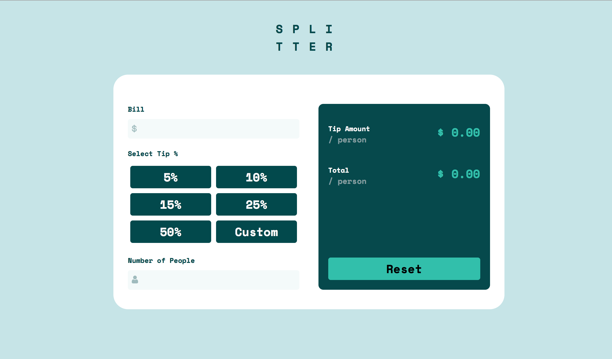

# Frontend Mentor - Tip calculator app solution

This is a solution to the [Tip calculator app challenge on Frontend Mentor](https://www.frontendmentor.io/challenges/tip-calculator-app-ugJNGbJUX).

## Table of contents

- [Overview](#overview)
  - [Screenshot](#screenshot)
  - [Links](#links)
- [My process](#my-process)
  - [Built with](#built-with)
  - [What I learned](#what-i-learned)
- [Author](#author)

## Overview

### Screenshot

Desktop 💻  

Mobile 📱  

### Links

- Live Site URL: [Click me !](https://beckyyyyy.github.io/portfolio/tip%20calculator%20app/)

## My process

### Built with

- Semantic HTML5 markup
- CSS custom properties
- Flexbox
- Mobile-first workflow
- JavaScript

### What I learned

1. 監聽器的運用
2. 練習用 forEach 來處理多個按鈕
3. 透過 html 標籤中 data-set 的屬性自訂資料，提供 js 端做數據的運算

## Author

- [Website](https://beckyyyyy.github.io/portfolio/)
- [Gmail](nkes50723@gmail.com)
